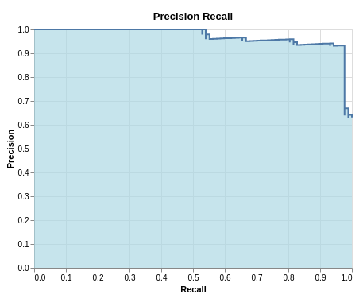

# PyPaDRe - Python Platform for mAchine learning and Data science Reproducibility
PaDRe is an open source tool for managing machine learning projects and experiments, tracking the life cycle of each experiment, adding semantic 
meaning to the experiments and keeping track of different results and metrics. It should provide the following functions

- Manage data sets
- creating and managing projects for grouping of experiments
- creating and managing experiments within a project
- fetching and splitting data sets
- logging training tasks
- logging test tasks
- providing results
- Hyperparameter Optimization using different strategies (Grid Search, Evolutionary Algorithms[not yet implementd])
- inspecting results of individual experiments 
- Describing experiments using (semantic) metadata
- Linking experiments to git code (e.g. automatically push a git repository when running experiment) including client source code
- Caching data sets 
- Managing external data for experiments (e.g. external models, embeddings, additional data)

From the clients perspective, PaDRE could be also understood as package manager for data sets and experiments.

### Examples are under `examples`
All examples are grouped within individual folders with the folder name specifying what 
aspect of PaDRe is given in the example

## Wiki 

The project is documented and steered via the [wiki](https://gitlab.dimis.fim.uni-passau.de/RP-17-PaDReP/PyPaDRe/wikis/home)

# How PaDRe works
PaDRe is made for reproducibility and tracking of experiments over their lifetime. The backbone of PaDRe is git. Every experiment is added to the git and the user based source code is also git versioned.
It can be done either automatically or by the user provided and maintained git repository. Running an experiment requires the following
1. Project to which the experiment belongs
2. Name of the experiment
3. Description of the experiment
4. Pipeline specification of the experiment which would be a function
5. Dataset for the experiment
6. Splitting strategy for the experiment
7. A reference to the source code of the experiment

Using these parameters, an experiment object can be created. The user can then execute the experiment. While executing the experiment, the user can customize certain functionlities such as
1. Providing hyperparameters to the components in the pipeline
2. Dump intermediate results and/or metrics 
3. Specify what metrics are to be used
4. Specify whether the user needs the results written to disk or not

# Sharing of results
The padre experiment can be shared simply by sharing the git repository or by sharing the folder which contains the experiment.

# Installation instruction
Padre requires Python 3.7 and its development version too.
Padre can be installed simply by running pip install pypadre

# Quick Start Guide
Once PaDRe is installed, you can easily start running experiments. The examples package will give you a better idea on
the different features of PaDRe and how they can be coded. 

# Creating a Project
A project in PaDRe is a collection of one of more experiments. It helps gather experiments under a
common group. A project can be created via CLI or Code. To create a project, the user has to specify the following
- Name: A meaningful name for the project
- Description: A string that describes the main purpose of the project.
- Creator: A reference git that all experiments would be submodules of

# Creating an Experiment
In the context of Padre, an experiment is the processing of a dataset by a pipeline using some splitting strategy.
An experiment can be created via the CLI or code. An experiment requires the following parameters
- Name: Name of an experiment
- Description: A meaningful description of the experiment(classify twitter users etc)
- Dataset: The dataset object on which the experiment will be executed
- Pipeline: The pipeline that works on the dataset
- Reference: A reference git to the experiment source code

# Running an experiment
An experiment can be run using decorators or by calling execute on the experiment object.
The execute function accepts differrent parameters such as 
- dumping of intermediate output such as graph embedding or preprocessing outputs
- computing of intermediate results
- specifying the hyperparameters for each component

In addition to code, an experiment can be created and executed via decorators. This is done by 
annotating a function using the @app.experiment decorator and providing the different arguments in that annotation.
This would create an experiment and also execute it. The @app.dataset is also required to be defined for the dataset to
be retrieved.

# Visualization 
PaDRe supports visualization of the Datasets such as scatterplot, class balance and the correlation matrix.
Results of an experiment can also be visualized using PR curves and ROC curves. More examples and plots are provided 
within examples/18_visualizations

Example visualization of the precision recall curve

