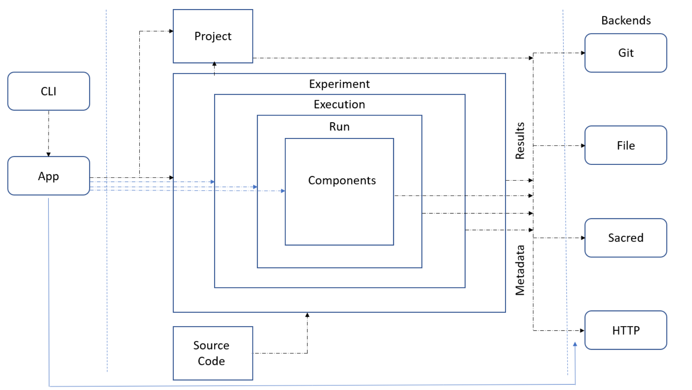

===============
PyPaDRE Concept
===============

Goals
-----

PaDRE (oPen mAchine learning and Data science Reproduciblity Environment [for education and research]) provides a web-based platform to
collect, compare and analys machine learning experiments in a systematic and open way. It builds on
Open Science principles and strives for improving research and education processes in disciplines
related to Machine Learning and Data Science.

PyPaDRE is the Python-centric environment to create and execute Machine Learning and Data Science experiments.
It aims to be a **minimal-invasive environment** for evaluating Machine Learning and Data Science experiments in a
**systematic and structured** way.
While PyPaDRE can be used as standalone, local solution for running and comparing experiments, all results can - and in the spirit of Open Science should - be made available via the PaDRE platform.

Use Cases
---------

Rapid Development Support
*************************

Padre's first use case is for rapid development by reducing scaffolding scientific experiments.
Users should be given

- easy access to datasets
- convenience functions for setting up experiments
- running the experiments
- comparing and visualising results
- packaging and deploying the experiment

Every experiment run should be logged in order to keep the experiments traceable / comparable.

Hyperparameter Optimization
***************************

After setting up an initial prototype, the next step is to do some initial hyperparameter tests.
Padre should support this via a few lines of code and make it easy to analyse the optimized hyperparameters / runs.

Large Scale Experimentation
***************************

Large scale experimentation aims at a later stage in the research cycle.
After developing an initial prototype there is often the need to setup larger experiments and compare the different
runs with each other, show error bars, test for statistical significance etc.
Large scale experimentation aims to define an experiment and hyperparameters to be tested and to deploy the
experiment runs over a larger cluster. Results could be checked online and compared online using web-based visualisation.
Results can be converted in different formats (e.g. latex, markedown).

Visual Analysis and Collaborative Exploration
*********************************************

Experimental results should be visualised / analysed in a interactive frontend and potentially discussed with others.

Interactive Publishing and Versioned Result Publishing
******************************************************

Experimental results should be accessible online and embedded in online publications (e.g. Blogs).
When new versions of experiments are available, a new version of the online publication should appear.
The versions need to be trackable.

Research Management and Collaboration
*************************************

Managing a smaller (PhD) or larger (funded project) research project should be fully supported by padre. This includes

- source code management
- experiment management and evaluation
- formulation of research questions
- collaboration on experiments, interpretation and writing
- issue tracking and discussion

Architecture
------------

The following figure shows the overall architecture.

PyPaDRE (in blue) provides means to

- Manage local and remote data sets
- Create, run and compare experiments
- Automatically identify hyperparameters and components of workflows from SKLearn and PyTorch
- Provide an easy to use Python and CLI interface
- Syncronize all resources with the PaDRE Server

while being minimal invasive.

Researchers should use their favorite tools and environments in order to conduct there research while PyPaDRE takes
care of managing resources and experiments in the background.

Experiments and Pipelines
*************************

In order to do so, PyPaDRE defines four core concepts: pipelines, experiments, runs and splits.

- **Pipelines/Workflows** are the actual machine learning workflows which can be trained and tested. Currently we support SKLearn and PyTorch based pipelines, where in its simplest case a pipeline only needs to implement an infer and a fit fucntion
- **Experiments** define the experimental setup consisting of a pipeline (i.e. the executable code), a dataset, and hyperparameters controlling the experiment as well as parameters controlling the experimental setup (e.g. splitting strategy)
- **Runs** are single instances of experiments with a specific set of hyperparameter-value
- **Splits** are the actual executions of a run, i.e. the execution of the workflow, over a dataset split.

In general, users do not have to care about Experiments, Runs and Splits.
They need to implement their pipeline or machine learning component that provides a `fit` and an `infer` function.
Additionally, a experiment configuration needs to be provided including a dataset.
When executing the experiment, PyPaDRE stores results and intermediate steps locally and adds it to the database of experiments.
Afterwards, it provides easy means to evaluate the experiments and compare them, as outlined below.

For more details please refer to Setting up Experiments :ref:`setup_experiments`.

Experiment Evaluation
---------------------

Storage
-------

Metasearch and Automated Machine Learning
-----------------------------------------

PyPadre App and CLI
-------------------

One core criterion of PyPaDRE is its ease of use and hence we support a class interface,
a high-level app interface and a command line interface.

Python Class Interface
**********************

First, when knowing the details of all packages PyPaDRE can be used in code.
This is either done by creating an :class:`padre.experiment.Experiment` or
through using decorators (currently under development). However, in this case
the user is responsible for using the correct backends to persist results to.

.. code-block:: python

    from padre.ds_import import load_sklearn_toys
    from padre.experiment import Experiment
    ds = [i for i in load_sklearn_toys()]
    ex = Experiment(name="Test Experiment SVM",
                    description="Testing Support Vector Machines via SKLearn Pipeline\n"
                                    "- no persisting via a backend\n"
                                    "- manual data set loading\n"
                                    "- default parameters",
                    dataset=ds[2],
                    workflow=Pipeline([('clf', SVC(probability=True))]))
    ex.run()

Please note, that this is not the standard case and proper evaluation classes are currently under development.

Python App Interface
********************

As a second interface, PyPaDRE support a high-level app. This high-level app integrates experiments, file backends, configuration
files and http server interface in a high level, easy to use interface.

.. code-block:: python

    from padre.ds_import import load_sklearn_toys
    from padre.app import pypadre
    from sklearn.pipeline import Pipeline
    from sklearn.svm import SVC
    ex = pypadre.experiments.run(name="Test Experiment SVM",
                                     description="Testing Support Vector Machines via SKLearn Pipeline",
                                     dataset=ds,
                                     workflow=Pipeline([('clf', SVC(probability=True))]))
    print("========Available experiments=========")
    for idx, ex in enumerate(pypadre.experiments.list_experiments()):
        print("%d: %s" % (idx, str(ex)))
        for idx2, run in enumerate(pypadre.experiments.list_runs(ex)):
            print("\tRun: %s" % str(run))

TODO: add more details here.

Python CLI Interface
********************

The third interface is a command line interface for using Python via a command line. Please note that not all
functions are available.