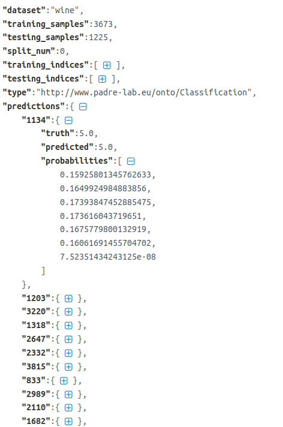
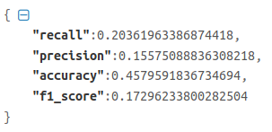

Experiment Storage and Online Synchronization
=============================================

Local Storage Structure
-----------------------
Git is the backbone of PaDRe. Every experiment, project and dataset is a git repository. Datasets are added with Git
LFS. Each experiment is a submodule of the project. For every experiment, a source code version is associated with the
experiment. Every time the source code changes, a new execution is created. Every execution of the experiment is a run.
A run is defined as the execution of the pipeline with a dataset. Runs are contained in executions so that every
particular run is associated with a specific version of the source code. Within each run, there are computations which
are nodes in the pipeline. The metadata and if needed output of the nodes are stored within these computations.

Storing of results
--------------------
The storing of results is mostly defined from the viewpoint of the FileBackend. The Git backend uses the stored results
from the FileBackend to add the files to the repository. The HTTPBackend is not discussed.

At the end of training the model, and if there are test indices, PaDRe tests the model using the dataset rows that are
specified using the test indices. The results are then stored in a JSON file containing the dataset name, the length of
the training and testing indices, the split number(for cross validation), and for each row in the testing dataset,
PaDRe stores the truth value, the predicted value and the probabilities. This is done because the user can easily
recompute the results if needed, or extend the experiment using custom metric evaluations.

At the end of training the model, and if there are test indices, PaDRe tests the model using the dataset rows that are
specified using the test indices. The results are then stored in a JSON file containing the dataset name, the length of
the training and testing indices, the split number(for cross validation), and for each row in the testing dataset,
PaDRe stores the truth value, the predicted value and

Server Synchronisation
----------------------

The server supports uploading and downloading of experiments but was developed as a Proof Of Concept. It is not
addressed in this documentation.

Versioning
**********
Versioning of PaDRe is done via Git. The user can use the Git to track the lifecycle of the experiment.
