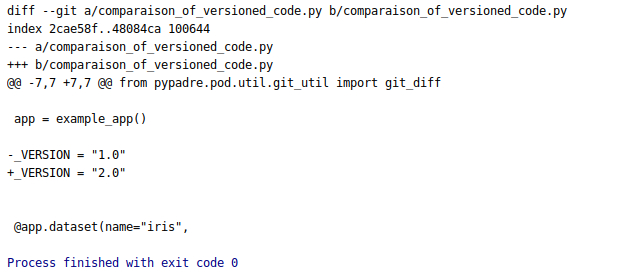

This example goal is to show how we can get the difference in the reference code using two different executions git hash.

First, we run the script in **comparaison_of_versioned_code.py**:

        import os

        from sklearn.datasets import load_iris
        import numpy as np
        from pypadre.examples.base_example import example_app
        from pypadre.pod.util.git_util import git_diff
        
        app = example_app()
        
        _VERSION = "1.0"
        
        
        @app.dataset(name="iris",
                     columns=['sepal length (cm)', 'sepal width (cm)', 'petal length (cm)',
                              'petal width (cm)', 'class'], target_features='class')
        def dataset():
            data = load_iris().data
            target = load_iris().target.reshape(-1, 1)
            return np.append(data, target, axis=1)
        
        
        @app.experiment(dataset=dataset,
                        reference_git=__file__,
                        experiment_name="Iris SVC_", project_name="Examples")
        def experiment():
            from sklearn.pipeline import Pipeline
            from sklearn.svm import SVC
            estimators = [('SVC', SVC(probability=True))]
            return Pipeline(estimators)
        
        if _VERSION != "1.0":
            # We list all different executions for the experiment defined above
            executions = app.executions.list({'experiment_id': experiment.id})
            # We extract the git hash which represents the version of code when executed a.k.a the corresponding commit ID
            git_references = [execution.reference.identifier.version() for execution in executions]
            git_repository_path = os.path.dirname(os.path.abspath(__file__))
            commitID1 = git_references[0]
            for commitid in git_references[1:]:
                print(git_diff(commitID1,commitid, git_repository_path))

Then, we change **_VERSION** to "2.0" and do some other changes if we want but changing _VERSION is enough in this example.

If we look then at the difference between the two executions using this part of the code:
        
        if _VERSION != "1.0":
        # We list all different executions for the experiment defined above
        executions = app.executions.list({'experiment_id': experiment.id})
        # We extract the git hash which represents the version of code when executed a.k.a the corresponding commit ID
        git_references = [execution.reference.identifier.version() for execution in executions]
        git_repository_path = os.path.dirname(os.path.abspath(__file__))
        commitID1 = git_references[0]
        for commitid in git_references[1:]:
            print(git_diff(commitID1,commitid, git_repository_path))

The output we get is the following:

