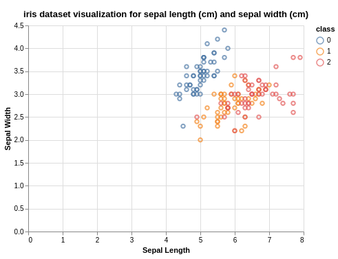
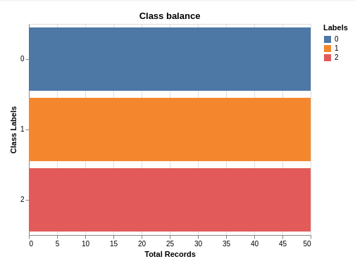
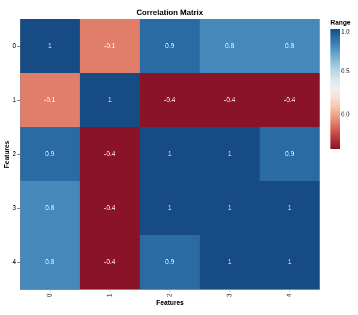

## Cross Platform Visualizations
Data visualization is an important technique used in applied statistics and machine
learning. Visualization is the easiest way to learn about the data. Sometimes, data does
not make any sense until you plot it on charts.
We are using Altair and Vega-Lite to create visualizations as JSON schema, which can be exported 
and viewed in any platform by using vega renderer.

We are creating two types of visualizations based on datasets and experimental results.

### Dataset Plots

* Scatter plot: This plot can be created by explicitly providing x and y attributes for the 
dataset.

* Class Balance: This represents number of data points belonging to each class.

* Correlation Matrix: This plot represents how strongly features are related with each other.
Following image is the correlation matrix for Iris dataset.

### Experiment Plots

* Confusion Matrix: Confusion matrix can be plotted by simply providing the path to metrics
file which contains the matrix after the execution of the experiment.

* Precision Recall Curve for Binary classification: Following image shows precision recall curve for
binary classification problem. Path to results.json file has to be provided.
Breast cancer dataset was used for this experiment.

* ROC Curve for Binary classification: Following image shows roc curve for
binary classification problem. Path to results.json file has to be provided.
Breast cancer dataset was used for this experiment.

